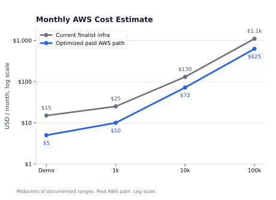
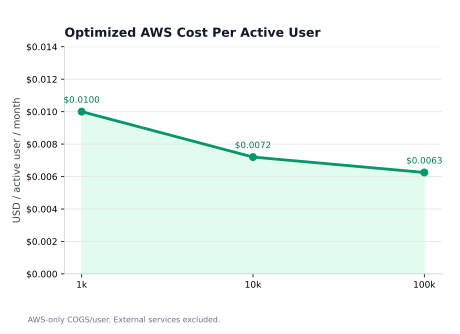

<div align="center">

# PocketBuddy

### Know what's safe before you spend.

PocketBuddy is a campus money and wellness companion for students. It captures payments passively, imports statements when needed, and turns everyday spending into runway, food, travel, and shared-purchase decisions.

<p>
  <a href="https://d3g6cg7q9hn7hi.cloudfront.net/"><strong>Live app</strong></a>
  ·
  <a href="https://d3g6cg7q9hn7hi.cloudfront.net/downloads/PocketBuddy-Connector-v0.1.0.apk"><strong>Android connector</strong></a>
  ·
  <a href="./docs/final-architecture-decisions.md"><strong>Architecture</strong></a>
  ·
  <a href="./docs/aws-e2e-deployment-runbook.md"><strong>AWS runbook</strong></a>
</p>

<p>
  
  
  
  
</p>

</div>

---

## Contents

- [Why PocketBuddy](#why-pocketbuddy)
- [Product Modules](#product-modules)
- [Demo Links](#demo-links)
- [Architecture](#architecture)
- [Tech Stack](#tech-stack)
- [Repository Layout](#repository-layout)
- [Run Locally](#run-locally)
- [Seed A Demo Account](#seed-a-demo-account)
- [Android Connector](#android-connector)
- [Verification](#verification)
- [Deploy](#deploy)
- [Security And Privacy](#security-and-privacy)
- [Cost Notes](#cost-notes)
- [Documentation](#documentation)

---

## Why PocketBuddy

Student spending is not one clean monthly budget. It is canteen payments, UPI transfers, shared room orders, transport quotes, subscriptions, exam weeks, skipped meals, and late-night decisions. The problem is not only tracking money after it is gone. The harder problem is noticing the pattern early enough to act.

PocketBuddy uses a simple product loop:

```text
capture -> review -> explain -> act
```

- **Capture:** Android notification sync and bank-statement import reduce manual entry.
- **Review:** ambiguous rows, unknown vendors, OCR candidates, and settlement matches stay reviewable.
- **Explain:** runway, food, travel, pool, and recurring-commitment engines turn raw transactions into context.
- **Act:** the app suggests concrete next steps: eat at mess, join a pool, question a fare, delay a purchase, or review a recurring debit.

## Product Modules

| Module | What it does | Why it exists |
| --- | --- | --- |
| Dashboard | Prioritizes urgent signals and routes the student into food, pools, travel, runway, and transactions. | The first screen should answer "what needs attention now?" |
| Android connector | Parses supported payment/SMS notifications on-device and syncs structured fields through the v2 ingest contract. | Students should not have to log every small UPI payment manually. |
| Transactions | Normalized ledger with manual logging, statement import, source labels, category cleanup, and repeated-vendor learning. | All capture paths must converge into one reviewable transaction history. |
| Runway | Forecasts safe daily spend, expected broke date, recurring commitments, pool debts, and "Can I afford this?" checks. | A student needs a forward-looking answer, not only last month's chart. |
| Food | Uses campus food data, transaction patterns, meal-gap check-ins, exam-window nudges, OCR candidates, and community verification. | Food is both a spending pattern and a routine signal. |
| Pools | Supports shared cart pools, host approval, item splits, payment QR fallback, UTR review, and conservative auto-verification. | Hostel purchases are shared, but repayment trust is usually manual. |
| Travel | Estimates route fares, shows mapped routes, checks driver quotes, stores crowd reports, and generates grounded negotiation guidance. | New students and visitors need local fare context before they overpay. |
| Privacy | Provides connector status, Account Aggregator sandbox flow, data controls, account purge, and masked parser feedback. | Notification access and finance data require visible controls, not hidden settings. |

## Demo Links

| Surface | Link |
| --- | --- |
| Web app | [https://d3g6cg7q9hn7hi.cloudfront.net/](https://d3g6cg7q9hn7hi.cloudfront.net/) |
| Hosted APK | [PocketBuddy-Connector-v0.1.0.apk](https://d3g6cg7q9hn7hi.cloudfront.net/downloads/PocketBuddy-Connector-v0.1.0.apk) |
| Repo APK | [android/releases/PocketBuddy-Connector-v0.1.0.apk](./android/releases/PocketBuddy-Connector-v0.1.0.apk) |
| Mobile ingest contract | [docs/mobile-ingest-contract.md](./docs/mobile-ingest-contract.md) |
| Deployment runbook | [docs/aws-e2e-deployment-runbook.md](./docs/aws-e2e-deployment-runbook.md) |

The APK is a sideloaded build. Android or Google Play Protect can warn because it is not distributed through the Play Store and requests notification access.

## Architecture

PocketBuddy currently runs a cost-controlled finalist deployment. The production AWS path keeps the same boundaries, but uses managed frontend hosting and a more elastic product API layer.

<p align="center">
  
</p>

Current finalist deployment:

```text
Browser
  -> CloudFront
      -> S3 private origin for React build and APK
      -> EC2 + Nginx + FastAPI for product APIs

Android Connector
  -> CloudFront /api/ingest/notification-v2
  -> API Gateway HTTP API
  -> Ingest Lambda
  -> SQS queue
  -> SQS DLQ
  -> Processor Lambda
  -> DynamoDB ingest ledger with TTL
  -> FastAPI canonical transaction path
  -> MongoDB Atlas product data

AI and observability
  -> Amazon Bedrock Nova Lite
  -> CloudWatch logs and alarms
  -> AWS Budgets
```

Production target:

```text
React/Vite frontend
  -> Amplify Hosting
  -> CloudFront edge delivery

FastAPI product API
  -> low-scale: HTTP API + Lambda
  -> growth-scale: ECS Express Mode / ECS Fargate

Android Connector
  -> API Gateway HTTP API
  -> Lambda
  -> SQS + DLQ
  -> Processor Lambda
  -> DynamoDB ingest ledger
  -> canonical transaction write path

Data and AI
  -> MongoDB Atlas product database
  -> Amazon Bedrock Nova Lite
  -> CloudWatch + AWS Budgets
```

### Service Boundaries

| Area | Service | Role |
| --- | --- | --- |
| Web delivery | Current: CloudFront + S3. Production path: Amplify Hosting | Serve the React build and APK; Amplify adds Git-based CI/CD, previews, custom domains, and managed releases. |
| Product API | Current: EC2 + Nginx + FastAPI. Production path: HTTP API + Lambda or ECS Express Mode | Auth, profile, transactions, pools, food, travel, runway, privacy. |
| Mobile ingest | API Gateway, Lambda, SQS, DLQ | Validate phone events, buffer bursts, retry failures. |
| Ingest ledger | DynamoDB | Store event IDs, dedupe keys, processing state, retry state, and TTL. |
| Product database | MongoDB Atlas | Store user-facing product state and application documents. |
| AI | Amazon Bedrock Nova Lite | Produce short guidance after deterministic code computes facts. |
| Operations | CloudWatch, AWS Budgets | Logs, alarms, and cost guardrails. |

For a real AWS launch, the frontend should be presented as **Amplify Hosting on top of AWS edge delivery**, not as a manually uploaded S3 bucket. The manual S3 + CloudFront setup remains useful for the hackathon because it is simple, cheap, and already deployed.

MongoDB and DynamoDB are not interchangeable here. MongoDB stores flexible product state. DynamoDB stores append-heavy mobile-ingest events for idempotency and replay safety.

## Tech Stack

| Layer | Technology |
| --- | --- |
| Frontend | React 19, Vite, TypeScript, TanStack Router, TanStack Query, Tailwind CSS, Recharts, Leaflet |
| Backend | Python, FastAPI, Pydantic, Motor/PyMongo, Boto3 |
| Android | Kotlin, NotificationListenerService, OkHttp, Android Keystore |
| Data | MongoDB Atlas, DynamoDB |
| AI | Amazon Bedrock Nova Lite |
| Cloud | Current: CloudFront, S3, EC2, Nginx, API Gateway, Lambda, SQS, CloudWatch, AWS Budgets. Production path: Amplify Hosting, HTTP API + Lambda, ECS Express Mode/ECS Fargate when justified |

## Repository Layout

```text
PocketBuddy/
  android/                 Native Android connector and local ingest test backend
  backend/                 FastAPI backend and Python tests
  data/                    Local/demo catalog data
  docs/                    Product, architecture, deployment, and demo context
  frontend/                React + Vite web application
  public/                  Static public assets
  scripts/                 Demo seeding and validation utilities
```

## Run Locally

### Prerequisites

- Node.js 20+
- Python 3.11+
- MongoDB Atlas URI or local MongoDB
- Android Studio, only if building the connector

### Install Dependencies

```powershell
cd "C:\Users\nhnis\Desktop\Amazon Hackon\PocketBuddy\PocketBuddy"
npm.cmd install

py -m venv backend\.venv
.\backend\.venv\Scripts\python.exe -m pip install -r backend\requirements.txt
Copy-Item backend\.env.example backend\.env
Copy-Item frontend\.env.example frontend\.env.local
```

Edit `backend\.env`:

```env
JWT_SECRET=replace_with_a_long_random_secret
MONGO_URI=mongodb://localhost:27017
PORT=8000
FRONTEND_BASE_URL=http://localhost:5173
BEDROCK_ENABLED=false
BEDROCK_MODEL_ID=us.amazon.nova-lite-v1:0
DEMO_MODE=false
```

For laptop-only frontend development, keep this in `frontend\.env.local`:

```env
VITE_API_PROXY_TARGET=http://127.0.0.1:8000
```

For phone testing, set `VITE_CONNECTOR_WEBHOOK_URL` to a LAN, ngrok, or CloudFront URL. A phone cannot reach the laptop's `localhost`.

### Start Backend

```powershell
.\backend\.venv\Scripts\python.exe -m uvicorn app.main:app --app-dir backend --reload --port 8000
```

### Start Frontend

```powershell
npm.cmd run dev --workspace=frontend
```

Open:

```text
http://localhost:5173
```

## Seed A Demo Account

The seed script rebuilds a selected user with realistic multi-month data: allowance income, expenses, food signals, pools, travel reports, recurring commitments, companion logs, exam dates, and runway inputs.

```powershell
cd "C:\Users\nhnis\Desktop\Amazon Hackon\PocketBuddy\PocketBuddy"
$env:PYTHONPATH="backend"
.\backend\.venv\Scripts\python.exe scripts\seed_demo_data.py --email "student@example.com" --password "Nishant@27"
```

Use a throwaway account. The script overwrites demo data for the selected user.

## Android Connector

The connector is the passive capture path for supported Android notifications.

It:

- runs only after notification access is granted;
- parses supported payment alerts on-device;
- rejects OTP and promotional noise;
- sends structured fields and a masked preview;
- signs v2 ingest requests;
- retries failed sends from a local queue;
- includes a transparency screen explaining what is uploaded.

Build and test:

```powershell
cd "C:\Users\nhnis\Desktop\Amazon Hackon\PocketBuddy\PocketBuddy"

$env:JAVA_HOME = "C:\Program Files\Android\Android Studio\jbr"
$env:Path = "$env:JAVA_HOME\bin;$env:LOCALAPPDATA\Android\Sdk\platform-tools;$env:Path"

.\android\gradlew.bat -p android :connector:testDebugUnitTest :connector:assembleDebug
```

Install on a connected phone:

```powershell
$ADB = "$env:LOCALAPPDATA\Android\Sdk\platform-tools\adb.exe"
& $ADB install -r .\android\connector\build\outputs\apk\debug\connector-debug.apk
```

See [android/README.md](./android/README.md).

## Verification

```powershell
git diff --check
npm.cmd run check --workspace=frontend
npm.cmd run build --workspace=frontend

$env:PYTHONPATH="backend"
.\backend\.venv\Scripts\python.exe -m unittest backend.tests.test_statement_import scripts.test_seed_demo_data
```

Android:

```powershell
.\android\gradlew.bat -p android :connector:testDebugUnitTest :connector:assembleDebug
```

## Deploy

### Frontend And APK

```powershell
npm.cmd run build --workspace=frontend
```

Upload `frontend/dist/` to the S3 frontend bucket and invalidate CloudFront:

```text
/*
```

Upload the APK to:

```text
s3://pocketbuddy-frontend-734705208425-ap-south-1/downloads/PocketBuddy-Connector-v0.1.0.apk
```

### Backend On EC2

```bash
cd /home/ubuntu/PocketBuddy
git pull --ff-only origin main
cd backend
.venv/bin/pip install -r requirements.txt
sudo systemctl restart pocketbuddy-backend
sudo systemctl status pocketbuddy-backend --no-pager
```

If the EC2 instance was stopped and restarted, verify that the CloudFront API origin still points to the correct host.

### Mobile Ingest

New Android builds use:

```text
/api/ingest/notification-v2
```

The ingest lane uses API Gateway, Lambda, SQS, a DLQ, DynamoDB TTL records, and CloudWatch alarms. See [docs/final-architecture-decisions.md](./docs/final-architecture-decisions.md) and [docs/aws-e2e-deployment-runbook.md](./docs/aws-e2e-deployment-runbook.md).

## Security And Privacy

- Do not commit `.env`, keystores, MongoDB URIs, JWT secrets, AWS keys, signing material, or real payment data.
- Android v2 ingest must not upload raw SMS or full notification text.
- Logs and previews should mask account numbers, phone numbers, UTRs, links, and email addresses.
- Statement-import files and PDF passwords are transient.
- Account Aggregator behavior is sandbox-only unless a real licensed provider is integrated.
- OCR rows remain review candidates until verified.
- Pool payment verification stays conservative when UTR, name, or amount matches are ambiguous.

## Cost Notes

The current deployment is intentionally cost-controlled. In the observed demo window, almost all AWS credit usage came from always-on EC2 compute and public IPv4/VPC charges; API Gateway, Lambda, SQS, DynamoDB, S3, CloudFront, and Bedrock were near-zero at demo traffic.

The optimized path assumes a **paid production AWS account**, not free-tier credits. The goal is to remove idle infrastructure first: move frontend delivery to Amplify Hosting, keep mobile ingest serverless, remove idle EC2/public IPv4 for low-scale production, and move the product API to Lambda only after MongoDB connection reuse and cold starts are tested. ECS Express Mode becomes relevant later, when sustained traffic justifies always-on containers and a load balancer.

| Scale | Current finalist infra | Optimized AWS path | Optimized AWS/user/month |
| --- | ---: | ---: | ---: |
| Demo / low traffic | `$12-15` | `$3-8` | not meaningful |
| 1k active users | `$20-30` | `$6-14` | `$0.006-0.014` |
| 10k active users | `$110-150` | `$45-100` | `$0.0045-0.010` |
| 100k / 1 lakh active users | `$900-1,300` | `$350-900` | `$0.0035-0.009` |

<table>
  <tr>
    <td align="center" width="50%">
      
    </td>
    <td align="center" width="50%">
      
    </td>
  </tr>
</table>

The chart uses midpoint values from the ranges above. It excludes MongoDB Atlas paid tiers, SMS/OTP, paid maps, OCR providers, custom domains, and support plans.

Cost rules:

- stop EC2 when the live backend is not needed;
- use paid production tiers for launch estimates, not AWS credits/free-tier assumptions;
- remove idle public IPv4 in the optimized path;
- avoid NAT Gateway for the current architecture;
- keep WAF, ALB, and ECS/Fargate out until their fixed monthly baselines are justified;
- use SSM Parameter Store standard parameters before Secrets Manager;
- keep Bedrock calls bounded and deterministic fallbacks available;
- keep DynamoDB TTL enabled for mobile-ingest events;
- keep Textract optional rather than a required menu-scanning dependency.

Full model: [docs/aws-cost-model.md](./docs/aws-cost-model.md).

## Documentation

| Document | Purpose |
| --- | --- |
| [docs/Initial-PRD.md](./docs/Initial-PRD.md) | Original problem statement and early requirements. |
| [docs/final-architecture-decisions.md](./docs/final-architecture-decisions.md) | Architecture decisions and AWS service boundaries. |
| [docs/aws-cost-model.md](./docs/aws-cost-model.md) | AWS cost model, scale estimates, graphs, and cost controls. |
| [docs/aws-e2e-deployment-runbook.md](./docs/aws-e2e-deployment-runbook.md) | AWS deployment and troubleshooting runbook. |
| [docs/mobile-ingest-contract.md](./docs/mobile-ingest-contract.md) | Android v2 webhook payload and privacy contract. |
| [docs/android-deployment-flow-context.md](./docs/android-deployment-flow-context.md) | Android pairing, testing, and deployment notes. |
| [docs/statement-import-lite.md](./docs/statement-import-lite.md) | Bank statement import parser behavior and limits. |
| [docs/menu-ocr-demo-fallback.md](./docs/menu-ocr-demo-fallback.md) | Menu scanner fallback and review-first OCR behavior. |
| [docs/travel-guard-context.md](./docs/travel-guard-context.md) | Travel feature logic and production limits. |
| [docs/food-guard-trust-context.md](./docs/food-guard-trust-context.md) | Food verification and trust model. |
| [backend/README.md](./backend/README.md) | Backend setup and route notes. |
| [android/README.md](./android/README.md) | Android connector setup, build, and release notes. |

## License

No open-source license has been published yet. Add a `LICENSE` file before accepting external production contributions.
