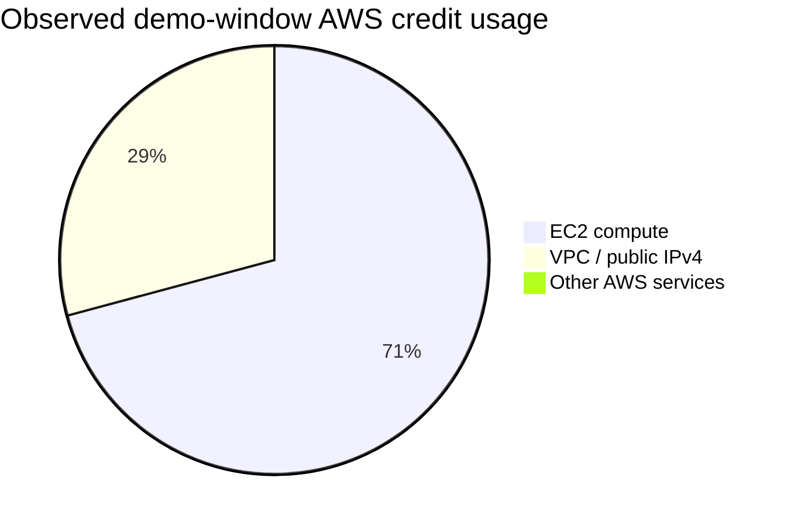

# PocketBuddy AWS Cost Model

Updated: 2026-07-11  
Currency: USD/month  
Scope: finalist deployment, optimized AWS path, user-scale estimates, and product unit economics

This is a planning model, not a bill. It combines:

- the team's observed AWS credit usage during the demo window;
- public AWS pricing pages;
- a realistic student-product traffic model;
- the way startups usually track infrastructure cost: fixed cost, variable cost, cost per active user, and gross-margin impact.

Actual cost will change with region, traffic, Bedrock usage, log volume, database tier, paid provider usage, and whether the backend is kept on EC2 or moved to a more elastic path.

## Executive Read

The current finalist deployment is cheap enough for demos, but not the cheapest architecture for idle time. The bill is dominated by always-on EC2 compute and public IPv4/VPC cost. The serverless ingest lane is already the right cost shape because it scales with phone events.

The optimized path assumes a **paid production AWS account**, not hackathon credits or free-tier dependency. The goal is to reduce idle waste while still using services the team could operate after launch:

1. use Amplify Hosting for managed frontend CI/CD and edge delivery, while keeping S3 + CloudFront as the low-cost manual finalist deployment;
2. keep API Gateway + Lambda + SQS + DLQ + DynamoDB for mobile ingest;
3. remove idle EC2/public IPv4 for low-scale production by moving the product API to HTTP API + Lambda, only if MongoDB connection reuse is handled correctly;
4. move to ECS Express Mode, ECS/Fargate, or EC2 autoscaling only when sustained traffic justifies always-on containers and load-balancer cost;
5. avoid App Runner as a new recommendation because AWS closed it to new customers after April 30, 2026 and recommends ECS Express Mode for migration.

## Observed Cost So Far

The finalist AWS account showed about `$4.49` applied credits across roughly 11 active days:

| Service group | Observed credit usage |
| --- | ---: |
| EC2 compute | `$3.18` |
| VPC / public IPv4 | `$1.31` |
| Bedrock, API Gateway, SQS, DynamoDB, S3, CloudFront | approximately `$0.00` at demo volume |

Monthly equivalent if the same EC2 setup stays on all month:

```text
($3.18 + $1.31) / 11 days * 30 days ~= $12.25/month
```

That is the important conclusion: the current bill is dominated by always-on compute and public IPv4, not the event-driven pieces.



## Pricing Anchors

| Service | Pricing signal used in model | Source |
| --- | --- | --- |
| EC2 | Always-on compute is charged while the instance is running | [AWS EC2 pricing](https://aws.amazon.com/ec2/pricing/on-demand/) |
| Public IPv4 | AWS charges public IPv4 addresses hourly | [AWS IPv4 pricing announcement](https://aws.amazon.com/blogs/aws/new-aws-public-ipv4-address-charge-public-ip-insights/) |
| CloudFront | CDN transfer and request pricing, modeled as a paid production bill rather than a credit/free-tier plan | [AWS CloudFront pricing](https://aws.amazon.com/cloudfront/pricing/) |
| S3 | S3 Standard is priced per GB stored and by request type | [Amazon S3 pricing](https://aws.amazon.com/s3/pricing/) |
| Amplify Hosting | managed frontend hosting with build minutes, storage, transfer, SSL, and CI/CD | [AWS Amplify pricing](https://aws.amazon.com/amplify/pricing/) |
| API Gateway HTTP API | about `$1.00` per million requests in the first 300M/month tier | [AWS API Gateway pricing](https://aws.amazon.com/api-gateway/pricing/) |
| Lambda | request and GB-second pricing; estimates use paid-rate style buffers instead of relying on free tier | [AWS Lambda pricing](https://aws.amazon.com/lambda/pricing/) |
| SQS | standard queue request pricing with paid-rate style buffers | [Amazon SQS pricing](https://aws.amazon.com/sqs/pricing/) |
| DynamoDB | on-demand mode charges by read/write request units | [DynamoDB on-demand docs](https://docs.aws.amazon.com/amazondynamodb/latest/developerguide/on-demand-capacity-mode.html) |
| CloudWatch | logs and alarms are usage based; log ingest can become a real cost driver | [CloudWatch pricing](https://aws.amazon.com/cloudwatch/pricing/) |
| Bedrock / Nova Lite | model cost depends on region, model, input tokens, and output tokens; the estimate uses Nova Lite-style short guidance calls | [Amazon Nova pricing](https://aws.amazon.com/nova/pricing/) |
| App Runner | not a preferred new choice; AWS says it is closed to new customers and recommends ECS Express Mode | [AWS App Runner availability change](https://docs.aws.amazon.com/apprunner/latest/dg/apprunner-availability-change.html) |
| Fargate / ECS | vCPU and memory are billed while tasks run | [AWS Fargate pricing](https://aws.amazon.com/fargate/pricing/) |
| ALB | fixed load balancer hourly cost plus LCU cost | [Elastic Load Balancing pricing](https://aws.amazon.com/elasticloadbalancing/pricing/) |
| SaaS gross margin | SaaS companies usually treat hosting/support as COGS and track gross margin | [Stripe SaaS gross margin guide](https://stripe.com/resources/more/saas-gross-margin-explained-what-it-is-and-why-it-is-important) |

## Traffic Assumptions

These assumptions are deliberately conservative for a student product:

| Metric | Assumption |
| --- | ---: |
| Payment/notification events per active user | 60/month |
| Product API calls per active user | 300/month |
| AI guidance calls per active user | 12/month |
| Average AI call size | 800 input tokens + 200 output tokens |
| Web sessions per active user | 20/month |
| Static transfer per web session | 1.5 MB |
| SQS requests per event | 3 requests/event |
| Mobile ingest Lambda invocations per event | 2 invocations/event |
| Product API Lambda assumption | 512 MB, 150 ms average |
| Mobile ingest Lambda assumption | 128 MB, 80-100 ms average |

The model assumes short Amazon Nova Lite-style guidance calls. If the app turns into an open-ended chat surface or uses a larger model, Bedrock becomes the fastest-growing line item.

## Paid-Rate Calculation Basis

The optimized model does **not** subtract free-tier allowances or credits. It uses paid-rate style calculations so the estimate still makes sense after launch.

| Cost line | Paid-rate basis used | Why it matters |
| --- | --- | --- |
| Frontend transfer | Amplify Hosting data transfer at `$0.15/GB served`, plus small build/storage overhead. | This is the biggest correction versus a naive free-tier model. At 100k users, static delivery can be hundreds of dollars/month. |
| Frontend volume | `active users * 20 sessions/month * 1.5 MB/session`, then range-adjusted for browser caching and repeat visits. | Product usage drives CDN transfer, even if the frontend is "static". |
| API Gateway HTTP API | `$1.00/M requests` for the first 300M requests/month, modeled without subtracting the free tier. | HTTP API is materially cheaper than REST API for this use case. |
| Product API Lambda | `300 product API calls/user/month * 512 MB * 150 ms`, plus `$0.20/M requests`. | Product API compute stays small until either latency, cold starts, or DB connections force containers. |
| Mobile ingest Lambda | `60 payment events/user/month * 2 Lambda invokes/event * 128 MB * 80-100 ms`, plus request charges. | Ingest is cheap because each function is short and payloads are small. |
| SQS | Standard queue request pricing, roughly `3 queue requests/event`, without subtracting monthly free requests. | Queue cost is low but still linear with notification volume. |
| DynamoDB ingest ledger | On-demand writes/reads with TTL; rough range assumes event idempotency writes, state updates, and replay metadata. | DynamoDB is used only for ingest events, not the full product database. |
| Bedrock Nova Lite | Amazon Nova Lite pricing of about `$0.06/M input tokens` and `$0.24/M output tokens`, with `12 calls/user/month`. | Short, grounded guidance keeps AI cost acceptable; open chat would change the economics. |
| CloudWatch | Log ingestion at about `$0.50/GB` plus metrics/alarms. | Logs can become more expensive than SQS/DynamoDB if debug payloads are left on. |

This is closer to how a startup/enterprise infra review is done: model paid usage, keep ranges for uncertainty, then watch the unit metric after launch.

## Architecture Scenarios

| Scenario | What runs where | Best for | Main cost behavior |
| --- | --- | --- | --- |
| Current finalist infra | S3 + CloudFront frontend, EC2 + Nginx + FastAPI product API, serverless mobile ingest | finals demo, quick recovery, minimal migration risk | fixed EC2 and public IPv4 cost even when idle |
| Optimized low-scale infra | Amplify Hosting frontend, HTTP API + Lambda product API, serverless mobile ingest, no public EC2 | paid production launch, previews, paused/demo periods | mostly request-based; low idle cost |
| Optimized growth infra | Amplify Hosting frontend, ECS Express Mode/ECS Fargate or EC2 ASG product API, serverless ingest | sustained traffic where containers beat Lambda ergonomics | higher fixed baseline, better control under steady load |

The optimized low-scale infra should not be chosen blindly. FastAPI-on-Lambda is viable only if database connection reuse and cold-start behavior are tested. If that is not stable, a small Graviton EC2 instance remains the safer operating choice until the team has time to move to containers properly.

### Frontend Hosting Decision

For a production AWS story, use **Amplify Hosting** as the named frontend platform. It gives Git-based deployments, managed SSL, custom domains, previews, and framework-aware builds. Under the hood, the delivery model is still CDN/static-asset oriented, but the product surface is what teams expect from a modern frontend platform.

The current S3 + CloudFront deployment is still valid for the hackathon because it is already running, cheap, and predictable. The distinction is:

| Question | Better answer |
| --- | --- |
| What did we use for the finalist demo? | CloudFront + private S3 origin for the built React assets and APK. |
| What would we use for production frontend operations? | Amplify Hosting for CI/CD, previews, custom domains, rollbacks, and managed releases. |
| Should the static frontend run on App Runner? | No. App Runner is a container service, and AWS has closed it to new customers. Static frontend hosting belongs on Amplify, Vercel, Netlify, Cloudflare Pages, or CloudFront/S3-style delivery. |

## Current Vs Optimized AWS Estimate

This estimate includes AWS delivery, product API capacity, mobile ingest, logging, and bounded Bedrock guidance. MongoDB Atlas is called out separately because it is outside AWS billing.

| Monthly active users | Current finalist infra | Optimized low-scale/growth infra | Optimized AWS/user/month | Why the optimized path is lower |
| ---: | ---: | ---: | ---: | --- |
| Demo / low traffic | `$12-15` | `$3-8` | not meaningful | removes idle EC2 and public IPv4, but keeps paid-production overhead |
| 1,000 | `$20-30` | `$6-14` | `$0.006-0.014` | request-based services scale with use instead of idle servers |
| 10,000 | `$110-150` | `$45-100` | `$0.0045-0.010` | request-based API, short logs, bounded Bedrock |
| 100,000 / 1 lakh | `$900-1,300` | `$350-900` | `$0.0035-0.009` | frontend transfer and Bedrock dominate, but idle compute is gone |

<table>
  <tr>
    <td align="center" width="50%">
      
    </td>
    <td align="center" width="50%">
      
    </td>
  </tr>
</table>

The chart uses midpoint values from the ranges above. The left panel compares current finalist infrastructure with the optimized AWS path. The right panel shows the optimized AWS cost per active user.

## Optimized Cost Breakdown

The ranges below are the reason the optimized total is lower. They use midpoint traffic assumptions, then leave buffer for regional pricing, log volume, retries, and traffic spikes.

| AWS line item | 1k MAU | 10k MAU | 100k / 1 lakh MAU | Notes |
| --- | ---: | ---: | ---: | --- |
| Frontend hosting | `$0-3` | `$15-45` | `$150-450` | Amplify/CloudFront-style hosting: build minutes, storage, transfer, SSL, and CDN delivery. |
| HTTP API | `$0-1` | `$3-5` | `$35-45` | Product API + ingest API requests. HTTP API is used instead of REST API for cost. |
| Lambda | `$0-2` | `$3-8` | `$35-70` | Product API functions are heavier than ingest functions; DB connection reuse matters. |
| SQS + DynamoDB ingest ledger | `$0-1` | `$1-6` | `$10-25` | Event volume is predictable: payment events, retries, idempotency writes, TTL cleanup. |
| Bedrock Nova Lite-style guidance | `$1-3` | `$10-18` | `$100-150` | Assumes short, bounded prompts. Open chat would break this model. |
| CloudWatch logs + alarms | `$2-5` | `$8-25` | `$35-120` | Biggest hidden risk if raw payloads or verbose debug logs are left on. |
| AWS overhead / buffer | `$2-4` | `$5-15` | `$25-50` | Covers small S3 requests, retries, budgets, metrics, regional variance, and safety margin. |
| **Total** | **`$6-14`** | **`$45-100`** | **`$350-900`** | MongoDB Atlas, paid SMS, paid maps, and OCR are excluded. |

This is how a startup or enterprise finance review would look at the infra: fixed cost first, then variable cost per active user, then gross-margin pressure.

## Startup / Enterprise Measurement Lens

Startups and enterprise SaaS teams usually do not present infra as one flat bill. They break it into unit economics:

| Metric | How PocketBuddy should track it |
| --- | --- |
| Fixed platform cost | Baseline AWS services that run before any user activity: EC2, public IPv4, WAF, ALB, container tasks. |
| Variable COGS | API calls, Lambda GB-seconds, SQS requests, DynamoDB reads/writes, CloudFront transfer, Bedrock tokens, logs. |
| AWS COGS per active user | `monthly AWS cost / monthly active users`. |
| Gross margin pressure | `1 - infra COGS / revenue`. Good SaaS businesses commonly target high gross margin; infrastructure should stay a small part of revenue. |
| Cost guardrail | Alert when AWS COGS/user or Bedrock/user crosses the planned threshold. |

Illustrative AWS-only unit economics:

| Monthly active users | Optimized AWS/user/month | Product implication |
| ---: | ---: | --- |
| 1,000 | `$0.006-0.014` | More affected by fixed logs/alarms than raw requests. |
| 10,000 | `$0.0045-0.010` | Economies of scale start because fixed overhead is diluted. |
| 100,000 / 1 lakh | `$0.0035-0.009` | Frontend transfer, Bedrock, logs, and backend compute are the main controllable levers. |

This is healthy for either B2C or campus-paid pricing, as long as paid SMS, paid maps, OCR, and database tiers are separately controlled.

## External Database Estimate

MongoDB Atlas is outside the AWS bill today, so it must be budgeted separately.

| Monthly active users | MongoDB Atlas posture |
| ---: | --- |
| 1,000 | Paid small cluster is the safer production assumption; shared/free tiers are demo-only. |
| 10,000 | Dedicated cluster likely required; index quality and read patterns matter more than raw document count. |
| 100,000 / 1 lakh | Production cluster sizing, backups, point-in-time restore, analytics workloads, and read/write load become a separate COGS line. |

If AWS-only consolidation becomes important, evaluate DocumentDB or DynamoDB for selected bounded entities. Do not migrate the full product database just to make the architecture look "more AWS"; the data model should drive the decision.

## Service-Level Reading

| Service group | Behavior at demo scale | Behavior at 100k MAU |
| --- | --- | --- |
| EC2 / backend | Fixed cost. Biggest current line item. | Keep only if stable small instances are cheaper than migration risk; otherwise autoscale. |
| Public IPv4 / VPC | Fixed hourly charge while public IP exists. | Remove when moving the API behind serverless or private container routing. |
| Amplify / CloudFront / S3 | Low at demo traffic. | Visible as transfer grows; Amplify adds CI/CD and release workflow. |
| API Gateway HTTP API | Near-zero for demo. | Linear and predictable with product + ingest requests. |
| Lambda | Near-zero for demo. | Cheap if functions stay short; cold starts and DB connections are the real engineering constraints. |
| SQS | Near-zero at demo scale. | Cheap linear buffer cost. |
| DynamoDB | Tiny at demo scale. | Cheap ingest ledger if item size stays small and TTL is enabled. |
| Bedrock | Zero when disabled; small when bounded. | Grows with AI calls and output length. Keep prompts short. |
| CloudWatch | Low if log retention is short. | Can become expensive if every event logs large payloads. |
| MongoDB Atlas | Outside AWS bill. | Must be budgeted as product data grows. |

## Cost Control Rules

Use these rules before every mentor/demo/finals run:

1. Stop EC2 when the live backend is not needed.
2. Remove public IPv4 dependency in the optimized path.
3. Do not create NAT Gateway for this architecture.
4. Keep WAF off until the fixed Web ACL/rule cost is accepted.
5. Use SSM Parameter Store standard parameters before Secrets Manager.
6. Keep Bedrock calls short, grounded, and optional.
7. Keep CloudWatch log retention short.
8. Keep DynamoDB TTL enabled for ingest ledger records.
9. Keep OCR review-first and avoid Textract as a required dependency.
10. Track AWS COGS/user and Bedrock cost/user, not just total bill.
11. Do not recommend App Runner for a new AWS build; use ECS Express Mode/ECS Fargate when container hosting is justified.
12. Avoid ALB/ECS/Fargate until sustained traffic justifies the fixed load balancer/container baseline.

## What To Say If Asked

> The current bill is mostly EC2 and public IPv4, not the serverless ingest system. For the finals window, EC2 is the safest stable backend. For an optimized launch, frontend operations move to Amplify Hosting, mobile ingest stays serverless, and the product API moves to HTTP API plus Lambda only after we validate MongoDB connection reuse and cold-start behavior. If traffic becomes steady enough that containers are cleaner than Lambda, we move the API to ECS Express Mode/ECS Fargate. At scale, the metric we manage is AWS COGS per active user, with frontend transfer, Bedrock, logs, backend compute, and database tier treated as the main cost levers.

## What Is Not Included

- MongoDB Atlas paid production cluster costs.
- SMS/OTP provider charges.
- Paid map/routing provider charges.
- Paid OCR provider charges.
- Custom domain renewal.
- Support plans.
- Team/dev tooling.

Those should be added before a real launch budget.
